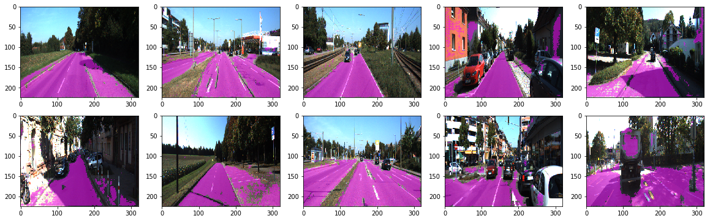

# Fully Convolutional Networks for Semantic Segmentation
---

    

Pytorch implementation of [paper](https://people.eecs.berkeley.edu/~jonlong/long_shelhamer_fcn.pdf) from berkeley@Jonathan Long.

### Dataset
I use KITTI road dataset, you can download [link](http://www.cvlibs.net/datasets/kitti/eval_road.php).

### Packages
You will need the following package before you go through the tutorials. 
``Recommand you using Anaconda 3 !!!``
1. pytorch >= 1.0.0
2. torchsummary

### Summary
FCN is using skipped network which stitches the pooling layers of pretrained model to compensate important features while training.

### Guidance
I think everyone eagered to see the result while the beginning. Hence, I recommend you to see what you got after this tutorials.
[demo.ipynb](demo.ipynb) 

Next, you will want to see the structure of this powerful model.
[introduction.ipynb](introduction.ipynb)

Last but not least, you will want to learn how you can build your own model.
[train.ipynb](train.ipynb)